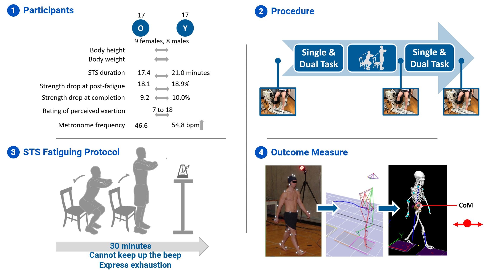
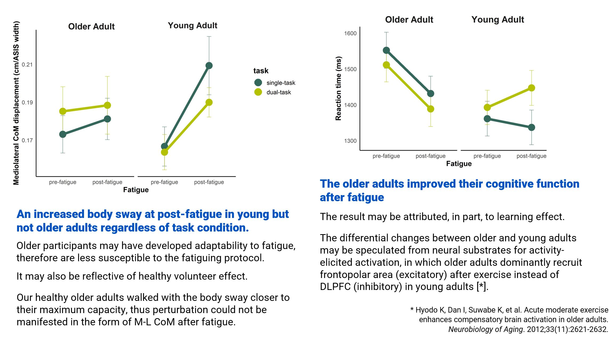

```{r setup, include=FALSE}
options(htmltools.dir.version = FALSE)
library(tidyverse)
library(xaringanExtra)
```

```{r xaringan-panelset, echo=FALSE}
xaringanExtra::use_panelset()
```

```{css echo=FALSE}
.panelset {
  --panel-tab-color: currentColor;
  --panel-tab-color-active: #0051BA;
  --panel-tab-color-hover: #d22;
  --panel-tabs-border-bottom: #ddd;
  --panel-tab-inactive-opacity: 0.5;
  --panel-tab-font-family: Roboto, Menlo, Consolas, Monaco, Liberation Mono, Lucida Console, monospace;\
}
```


.panelset[


.panel[.panel-name[Summary]


]

.panel[.panel-name[Background]


]

.panel[.panel-name[Methods]



]


.panel[.panel-name[Discussion]



]


.panel[.panel-name[Contact]

# Find me at...

`r icon::fontawesome("paper-plane", style = "solid")`  teresa.sh.chen@gmail.com  
`r icon::fontawesome$brands$twitter` ptteresachen 
`r icon::fontawesome$brands$github` teresashchen

]


]

